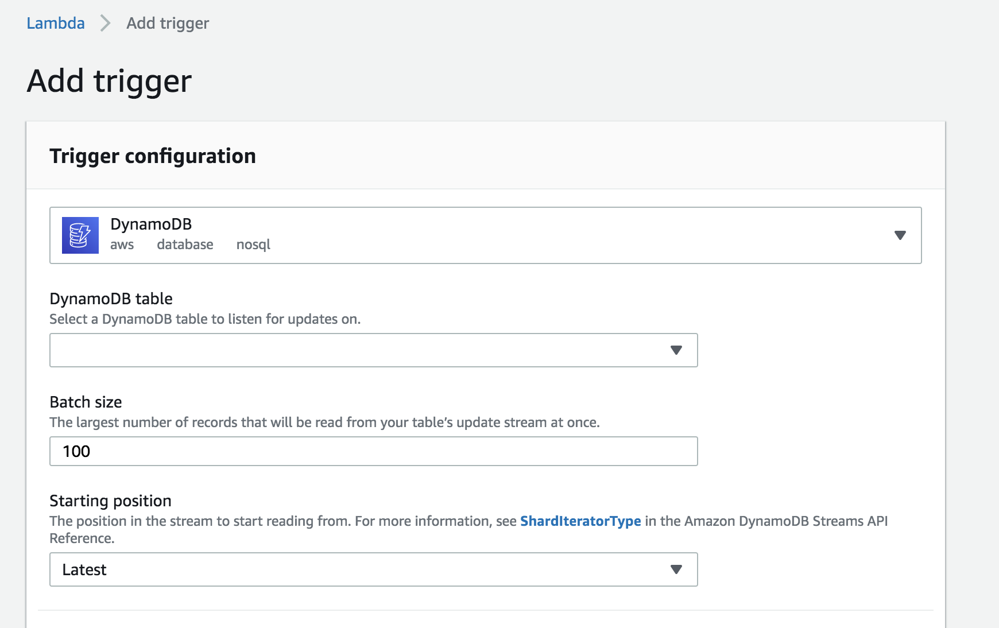

# Task Master

This is an app that allows a user to track tasks that need to be done.  A user can save a task and then update its status as it gets assigned, accepted, completed, etc.

# API
## GET routes:
/tasks - get request to this route returns a list of all the tasks in the database.  
/users/{assignee}/tasks - get request to this route returns all of the tasks for the assignee given.  
/tasks/{id} - get request to this route will return the task with the given id.

## POST routes:
/tasks - post request to this route with a title and description in the body as parameters will create a new task in the db.  
/tasks/{id}/images - posts to this route with a image file will upload the file to the s3 bucket for images and append the image url for that file to the task.

## PUT routes: 
/tasks/{id}/state - put request with the task id will update the task state to the next state.(Available, Assigned, Accepted, Finished)
/tasks/{id}/assign/{assignee} - put request to this route with a task id and an assignee name will assign the task to that person, and update the task to "Assigned" status.  

# Deployed Site
`http://taskmaster-env.txmi2mw3a9.us-east-2.elasticbeanstalk.com`

## Images for Lab 39
